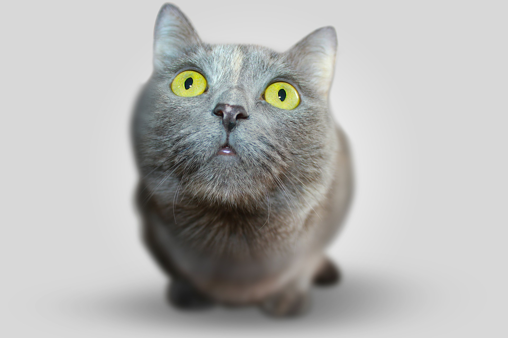
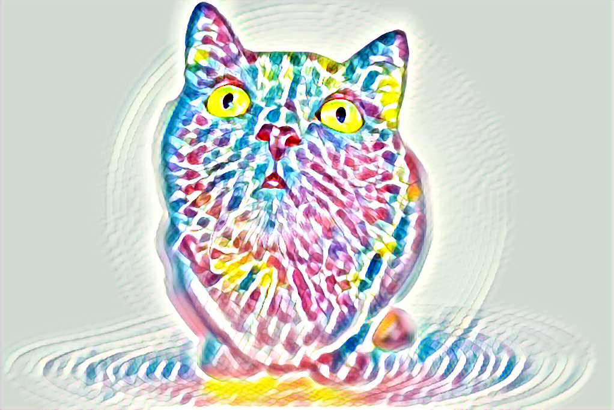

# structure-nst

This is the code for the paper

**[Structure-Preserving Neural Style Transfer](https://ieeexplore.ieee.org/stamp/stamp.jsp?tp=&arnumber=8816670)**

Accepted by [IEEE Transactions on Image Processing](https://ieeexplore.ieee.org/document/8816670)

This work is inspired and closely related to the paper:
[Perceptual Losses for Real-Time Style Transfer and Super-Resolution](http://cs.stanford.edu/people/jcjohns/eccv16/)
by Justin Johnson, Alexandre Alahi and Fei-Fei Li.

If you find this code useful for your research, please cite

```
@ARTICLE{TIP20_SP_NPR, 
	author={Ming-Ming Cheng and Xiao-Chang Liu and Jie Wang and Shao-Ping Lu and Yu-Kun Lai and Paul L. Rosin}, 
	journal={IEEE Transactions on Image Processing}, 
	title={Structure-Preserving Neural Style Transfer}, 
	year={2020}, 
	volume={29},  
	pages={909-920}, 
	doi={10.1109/TIP.2019.2936746}
}
```

## Preresquisites
All code is implemented in [Torch](http://torch.ch/).

First [install Torch](http://torch.ch/docs/getting-started.html#installing-torch), then
update / install the following packages:

```bash
luarocks install torch
luarocks install nn
luarocks install image
luarocks install lua-cjson
```

### (Optional) GPU Acceleration

If you have an NVIDIA GPU, you can accelerate all operations with CUDA.

First [install CUDA](https://developer.nvidia.com/cuda-downloads), then
update / install the following packages:

```bash
luarocks install cutorch
luarocks install cunn
```

### (Optional) cuDNN

When using CUDA, you can use cuDNN to accelerate convolutions.

First [download cuDNN](https://developer.nvidia.com/cudnn) and copy the
libraries to `/usr/local/cuda/lib64/`. Then install the Torch bindings for cuDNN:

```bash
luarocks install cudnn
```

## Running on new images
The script `fast_neural_style.lua` lets you use a trained model to stylize new images:

```bash
th fast_neural_style.lua \
  -model trained_models/feathers.t7 \
  -input_image images/content/cat.jpg \
  -output_image out.png
```

<p align='center'>
  
  
  
</ p>

## Training new models

You can [find instructions for training new models here](doc/training.md).

## Acknowledgement
This project is inspired by many existing methods and their open-source implementations, including:
* [Perceptual Losses for Real-Time Style Transfer and Super-Resolution](https://arxiv.org/abs/1603.08155) [[code](https://github.com/jcjohnson/fast-neural-style)]
* [Holistically-Nested Edge Detection](https://www.cv-foundation.org/openaccess/content_iccv_2015/papers/Xie_Holistically-Nested_Edge_Detection_ICCV_2015_paper.pdf) [[code](https://github.com/s9xie/hed)]
* [Single-Image Depth Perception in the Wild](https://papers.nips.cc/paper/6489-single-image-depth-perception-in-the-wild.pdf) [[code](https://github.com/princeton-vl/relative_depth)]
* [SqueezeNet: AlexNet-level accuracy with 50x fewer parameters and <0.5MB model size](https://arxiv.org/pdf/1602.07360.pdf)

